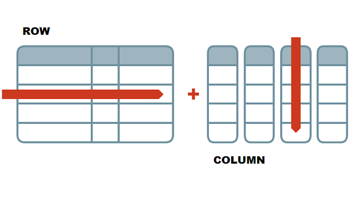

```{r setup, include=FALSE}
knitr::opts_chunk$set(echo = TRUE)
```

# Introduction to Coding

## Learning Outcomes

-   Students will be able to define the following terms: object, assignment, vector, function, data frame
-   Students will be able to run code line-by-line and as code chunks from an Rmarkdown file.
-   Students will be able to write code assigning values to variables and use these variables to perform various operations.
-   Students will be able to recall and explain how functions operate, and the basic syntax around functions (arguments, auto-completion, parentheses).
-   Students will be able to differentiate different data classes in R.

## Assigning Objects

Assignments are really key to almost everything we do in R. This is how we create permanence in R. Anything can be saved to an object, and we do this with the assignment operator, `<-`.

The short-cut for `<-` is `Alt + -` (or `Option + -` on a Mac)

```{r}


```

## 1-Dimensional Data: Vectors

We can also assign more complex group of elements of the same type to a particular object. This is called a **vector**, a basic data structure in R.

```{r}

```

## Data classes

There are a few main types of data in R, and they behave differently. We call these types of data "classes."

-   numeric / double (numbers, decimals allowed)
-   integer (no decimals allowed)
-   character (letters or mixture)
-   logical (True or False; T or F)
-   factors (best used for data that need to be in a specific order; levels indicate the order)

```{r}

```

Vectors have to contain elements that are all of the same class. What happens if we put data of different classes into one vector?

```{r, eval = FALSE}

```

## Sub-setting Vectors

Sometimes we want to keep only specific values from a vector. This is called subsetting (taking a smaller set of the original).

We can subset vectors in two different ways:

-   by index
-   by condition

Regardless of which type of subsetting we choose, we indicate that we want to subset by using square brackets: `[]`.

### Subsetting by Index

When we subset by index, we are subsetting based on the position of an element in the vector.

```{r}

```

### Subsetting by Condition

Sometimes we don't know or don't want to list out all of the locations for the data we need. Instead, we might want to subset based on a quality of the data itself.

To do this, we set a "condition" that must be met in order for the data to be returned.

```{r}

```

## Functions

[Functions]{.underline} are pre-written bits of codes that perform specific tasks for us. Functions are always followed by parentheses.

Anything you type into the parentheses are called [arguments]{.underline}. Arguments are pieces of information that we give to a function so it performs its task the way we want it to. To add more than one argument, you separate them with a comma.

```{r}

```

To get more information about a function, use the `help()` function or `?name_of_function`.

```{r}

```

We can use a function called `class()` to figure out the data type of a vector.

```{r}

```

### Small Group Challenge

Let's practice! Write a few lines of code that do the following:

-   create a vector with numbers from 6 to 1 (6, 5, 4, 3, 2, 1)
-   assign the vector to an object named `six_to_one`
-   subset `six_to_one` to include the last 3 numbers (should include 3, 2, 1)
-   find the sum of the numbers (hint: use the `sum()` function)

Answer: 6

```{r}

```

Already finished? See if you can condense your code down any further or turn around and help out a neighbor.

```{r}

```

## 2-Dimensional Data: Data Frames

Most of the data you will encounter is two-dimensional, i.e., it has columns and rows. Its structure resembles a spreadsheet. R is really good with these types of data. We call these 2D object [data frames]{.underline}.

Columns typically represent variables (a factor, trait, or condition) we are interested in.

Rows represent observations. Each row will be one set of observations.

-   **rows** go side-to-side
-   **columns** go up-and-down



Data frames are made up of multiple vectors. Each vector becomes a column.

```{r}
# Create a data frame from scratch
# I will never ask you to do this on your own!
plants <- data.frame(height = c(55, 17, 42, 47, 68, 39, 51, 23),
                     nitrogen = c("Y", "N", "N", "Y", "Y", "N", "Y", "N"))

plants
```

## Subsetting Data Frames

Because data frames are two-dimensional, we can subset the data in a data frame by selecting specific columns, specific rows, or both!

R *always* takes information for the row first, then the column.

Just like with vectors, we can subset data frames by index or by condition using square brackets.

The pattern is `dataframe[rows, columns]`.

#### Subsetting by Index

```{r}

```

Another way to pull out a single column from a data frame is with the `$` operator. This can really come in handy when you know the name of the column but not the position.

```{r}

```

Regardless of how you specify the column, you can put that code inside of a function, such as the `mean()`.

```{r}

```

### Subsetting by Condition

This is a simple data set, but we can use it to ask a question.

Example: Are the heights of plants treated with nitrogen different from those not treated?

First, we will need to keep only the plants that were treated with nitrogen.

```{r}

```

We can create a new data frame by saving the subset data frame to a new object.

```{r}

```

### Small Group Challenge (5 min)

As a group, find the standard deviation (`sd()`) of the height of plants treated with nitrogen and those not treated with nitrogen. Which group has the larger standard deviation? Any ideas what that means?

```{r}

```

## Helpful Functions

Below are some functions that I often find very helpful when working with vectors and data frames:

-   `str()`: shows the structure of the object (e.g., rows and columns)
-   `head()` and `tail()`: shows the first six and last six rows, respectfully
-   `length()`: counts the number of elements in an object
-   `ncol()` and `nrow()`: counts the number of columns or rows, respectfully
-   `names()`: shows the names of the columns in a data frame
-   `unique()`: shows one of each element in an object (removes duplicate values)

```{r}

```
