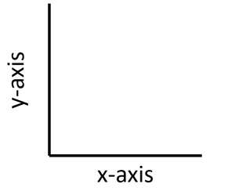

```{r setup, include=FALSE}
knitr::opts_chunk$set(echo = TRUE)
```

# Plotting with `ggplot2`

So far, we've used the base R plotting syntax. While quick plots in base
R can still be really useful ways to do preliminary data exploration and
visualization, we often want plots that go beyond the basics without too
much additional effort. This is where `ggplot2` comes in and really
shines!

## Example

Before we get into the nitty-gritty of how `ggplot2` works, Let's run an
example using the data about our sick crew members from earlier.

First, we need to load in both the `tidyverse` package and our data. We
can remind ourselves what the data look like using the `head()`
function.

```{r}
# load package

# load data

```

Here is code to make a scatter plot of the relationship between percent
fish in diets and how many trips to the doctor.

```{r}
# example ggplot
ggplot(sick, aes(x = perc_fish, y = doctor_trips)) +
  geom_point() +
  labs(x = "Percent Fish in Diet",
       y = "Number of Trips to the Doctor") +
  theme_light()
```

Nice, right? In the next few classes, we will really start to see the
power of `ggplot`. For now, though, let's focus on how this works.

## `ggplot2`

The package `ggplot2` is part of the `tidyverse`.

Here are some resources you might find helpful now or in the future:

-   [ggplot2 Book](https://ggplot2-book.org/getting-started.html)
-   [UC Business Analytics ggplot2
    intro](https://uc-r.github.io/ggplot_intro)
-   [R for Data Science Data Visualization
    chapter](https://r4ds.had.co.nz/data-visualisation.html)

The `gg` in `ggplot2` stands for "Grammar of Graphics." The "grammar"
part is based on an idea that all statistical plots have the same
fundamental features: data and mapping (and specific components of
mapping.

The design is that you work iteratively, building up layer upon layer
until you have your final plot.

The typical structure looks like this:

| `ggplot(data = <DATA>, mapping = aes(<MAPPINGS>)) +`
| `<GEOM_FUNCTION>()`

Let's iteratively build up to the plot we have made above:

1)  Specify the data

```{r}

```

As we've previously seen, most plots that we make display data in some way relative to two different axes: the x-axis (horizontal) and the y-axis (vertical).

{fig-align="center"}

You will definitely want to memorize which axis is which!

2)  Specify the x-axis (horizontal) and the y-axis (vertical) in the
    `aes()` function.

```{r}

```

3)  Add the type of plot we want using a `geom` function. For a scatter
    plot, we use `geom_point()`.

```{r}

```

4)  Clean up the axis labels with the `lab()` function so they are more
    easily interpreted.

```{r}

```

5)  Choose a `theme` function to make the plot more aesthetically
    pleasing and easier to read.

```{r}
# theme_bw(), theme_classic(), and theme_light() are my favorites

```

In Summary: A few things to note:

-   we always start with the `ggplot()` function
-   we specify the dataset we want to use
-   we specify the mappings (x- and y-axes and some other bits) with the
    `aes()` function
-   we use a `+` to add layers
-   we specify the type of plot, or `geom` using one of many possible
    geom functions
-   we use the `labs()` function to clean up the labels
-   we add a `theme` function to make it look extra pretty
