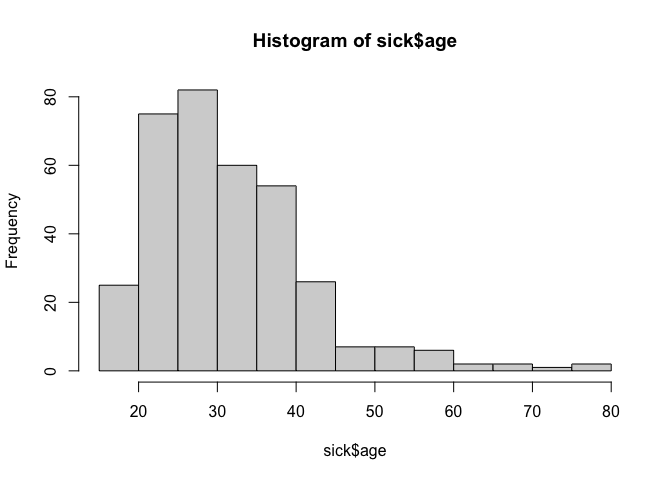
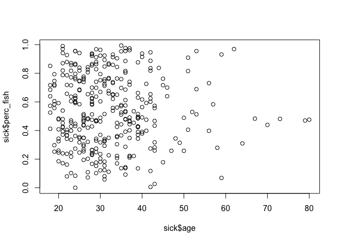
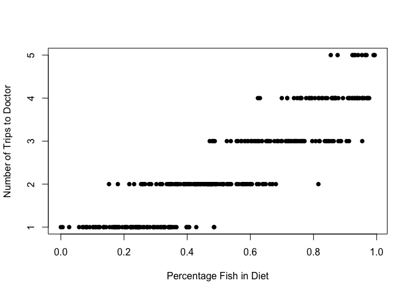

Module 2-1
================

## Learning Objectives

1.  Students will become familiar with the real-world problem for this
    module - food poisoning due to an outbreak of disease in one of the
    species of fish that is grown in recirculating aquaculture
    systems.  
2.  Students will be be able to generate two types of plots using base R
    syntax to visualize single variables (histograms and distributions)
    and two variables (scatterplots).
3.  Students will develop visual-thinking skills to create
    visualizations that allow them to explore patterns in data, draw
    inferences and create solutions.

## Introduction to the problem

Overall, the issue here is that we have a wave of people getting sick
across the team. People are coming in complaining of stomach sickness -
doctors have ruled out a communicable viral infection like norovirus,
and it seems to be a food contamination issue.

The two main sources of food that are grown on site and distributed to
team members are [plants grown in hydroponic
greenhouses](https://thespoon.tech/scientists-in-antarctica-grow-food-without-soil-or-sunlight-get-ready-mars/)
(mostly swiss chard, cucumbers and radishes) and fish (tilapia, a
tolerant warm -water species and rainbow trout, a cold-water species).

**Diagram this next part on the board**

We have a good set of data on team members that are sick, and how much
fish or plant material they incorporate into their diets (team members
vary in the composition of their diet - people are allowed to choose how
much of different food sources they use).

## Discussion - how might we figure this out?

Spend 5 minutes brainstorming in your groups how you might figure out
whether plants or fish are the culprits? Be ready to report out.

## Introduction to the dataset and visualization in R

First we’re going to pull in the data and give it a quick
inspection/exploration before we start to work through some of the
visualization tools in R.

``` r
library(tidyverse)
```

    ## ── Attaching packages ─────────────────────────────────────── tidyverse 1.3.1 ──

    ## ✓ ggplot2 3.3.5     ✓ purrr   0.3.4
    ## ✓ tibble  3.1.6     ✓ dplyr   1.0.7
    ## ✓ tidyr   1.1.4     ✓ stringr 1.4.0
    ## ✓ readr   2.1.1     ✓ forcats 0.5.1

    ## ── Conflicts ────────────────────────────────────────── tidyverse_conflicts() ──
    ## x dplyr::filter() masks stats::filter()
    ## x dplyr::lag()    masks stats::lag()

``` r
sick <- read_csv("../data/sick_data.csv")
```

    ## Rows: 349 Columns: 10

    ## ── Column specification ────────────────────────────────────────────────────────
    ## Delimiter: ","
    ## chr (4): last, first, sex, specialties
    ## dbl (6): age, height_cm, weight_kg, perc_fish, perc_plant, doctor_trips

    ## 
    ## ℹ Use `spec()` to retrieve the full column specification for this data.
    ## ℹ Specify the column types or set `show_col_types = FALSE` to quiet this message.

``` r
sick
```

    ## # A tibble: 349 × 10
    ##    last   first sex     age height_cm weight_kg specialties perc_fish perc_plant
    ##    <chr>  <chr> <chr> <dbl>     <dbl>     <dbl> <chr>           <dbl>      <dbl>
    ##  1 Gonza… Ange… M        35      169.      51.4 Hydrology       0.994    0.00620
    ##  2 Navra… John  M        19      112.      96.3 Genetics        0.297    0.703  
    ##  3 Duff   Josh… M        26      133.      52.1 Horticultu…     0.514    0.486  
    ##  4 Dotts… Juli… M        36      140.      52.6 Climatology     0.686    0.314  
    ##  5 al-Su… Mune… M        26      194.      52.2 Geology         0.292    0.708  
    ##  6 Galle… Rich… M        29      153.      98.1 Climatology     0.329    0.671  
    ##  7 Walker Trev… M        33      190.     102   Psychology      0.558    0.442  
    ##  8 Hau    Kin   M        22      118.      41.1 Psychology      0.237    0.763  
    ##  9 Zhong  Tobby M        21      121.      49.3 Mechanical…     0.427    0.573  
    ## 10 Scher… Rona… M        36      168.      62.7 Management      0.529    0.471  
    ## # … with 339 more rows, and 1 more variable: doctor_trips <dbl>

``` r
glimpse(sick)
```

    ## Rows: 349
    ## Columns: 10
    ## $ last         <chr> "Gonzalez", "Navratil", "Duff", "Dottson", "al-Sultana", …
    ## $ first        <chr> "Angelo", "John", "Joshua", "Julian", "Muneeb", "Richard"…
    ## $ sex          <chr> "M", "M", "M", "M", "M", "M", "M", "M", "M", "M", "F", "M…
    ## $ age          <dbl> 35, 19, 26, 36, 26, 29, 33, 22, 21, 36, 41, 24, 36, 28, 2…
    ## $ height_cm    <dbl> 169.4, 112.3, 132.8, 140.1, 194.3, 152.6, 189.6, 118.1, 1…
    ## $ weight_kg    <dbl> 51.4, 96.3, 52.1, 52.6, 52.2, 98.1, 102.0, 41.1, 49.3, 62…
    ## $ specialties  <chr> "Hydrology", "Genetics", "Horticulture", "Climatology", "…
    ## $ perc_fish    <dbl> 0.9937990, 0.2974799, 0.5138754, 0.6856123, 0.2923204, 0.…
    ## $ perc_plant   <dbl> 0.006200981, 0.702520140, 0.486124626, 0.314387706, 0.707…
    ## $ doctor_trips <dbl> 5, 1, 2, 3, 1, 1, 3, 1, 2, 2, 2, 3, 3, 2, 3, 4, 2, 3, 1, …

``` r
# Basic visualization - in base R, the plot(), and some others function is your 
# friend. We'll talk about some tidyverse ways to plot that are a bit more 
# powerful later, but you really can do any kind of plotting you want with base 
# R. 

hist(sick$age)
```

<!-- -->

## Mini Group Discussion - Histograms

What is this showing us? What conclusions can we draw from this data
visualization? How could this visualization be improved?

## Group Project - make a better histogram.

Work in your groups to build a histogram of weights with properly
labeled axes, a vertical line that depicts the median, and an
appropriate visually appealing bin size. Check out the `hist()` help
page, and the `abline()` function.

``` r
hist(sick$age, breaks = 15, xlab = "Age", ylab = "Frequency", main = NULL)
abline(v = median(sick$age))
```

<!-- -->

## Brainstorm - Group activity

We’ve covered one type of visualization that just shows one variable…
but what we’re really interested in is figuring out if fish or plants
are the culprit in food poisoning. Spend 10 minutes in your groups
sketching out a visualization that might give us insight into this.

## Scatter plots

``` r
plot(x = sick$age, y = sick$perc_fish)
```

<!-- -->

Not super informative, because there isn’t really a relationship between
a person’s age and the amount of fish they consume. At least not in this
sample.

# Building and interpreting

In your group, build out the plot that you conceived earlier that
determines whether there is a correlation between the percentage of fish
eaten and the number of trips to the doctor in the past 6 months. Use
proper labelling and aesthetic design principles to make it as visually
appealing as possible.

``` r
plot(x = sick$perc_fish, y = sick$doctor_trips, 
     xlab = "Percentage Fish in Diet", 
     ylab = "Number of Trips to Doctor", 
     main = NULL, 
     pch = 16)
```

<!-- -->
