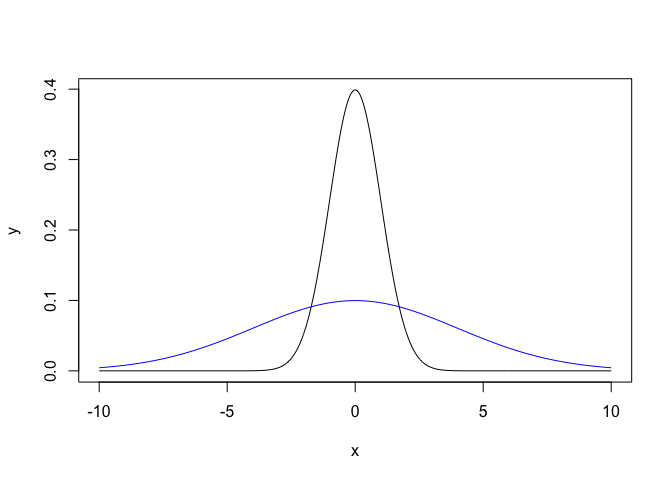

Module_2\_3
================
Keaton Wilson

## Using simulations

Today, we’re going to be talking about simulating data. Not in a ‘making
up data’ unethical framework, but using our assumptions and knowledge
about to build simulated data, and then comparing that to data we’ve
collected. This has a number of benefits over just comparing to summary
statistics of data…

We’ll talk about all of this in a second.

## Scenario - Research is costly

So here is the basic scenario. We found a correlation between eating
fish and people getting sick, but that isn’t really the root of the
problem. We don’t actually know if rates of disease are present above
average levels in the tanks, and we definitely don’t know what kinds of
factors are contributing to this problem (if there is one!).

Our first challenge is that we can’t sample the disease rate in all
tanks - it’s too expensive and it takes too long. So we’re going to task
our aqauaculture  
scientists to take a sub-sample (50 tanks). Our aquaculture scientists
have shared this data with us. It’s in the data folder and called
“fish_sick_data.csv”

Let’s scope it out:

``` r
library(tidyverse)
```

    ## ── Attaching packages ─────────────────────────────────────── tidyverse 1.3.1 ──

    ## ✓ ggplot2 3.3.5     ✓ purrr   0.3.4
    ## ✓ tibble  3.1.6     ✓ dplyr   1.0.7
    ## ✓ tidyr   1.1.4     ✓ stringr 1.4.0
    ## ✓ readr   2.1.1     ✓ forcats 0.5.1

    ## ── Conflicts ────────────────────────────────────────── tidyverse_conflicts() ──
    ## x dplyr::filter() masks stats::filter()
    ## x dplyr::lag()    masks stats::lag()

``` r
sick_fish = read_csv("../data/fish_sick_data.csv")
```

    ## Rows: 50 Columns: 8

    ## ── Column specification ────────────────────────────────────────────────────────
    ## Delimiter: ","
    ## chr (1): species
    ## dbl (7): tank_id, avg_daily_temp, num_fish, day_length, tank_volume, num_sic...

    ## 
    ## ℹ Use `spec()` to retrieve the full column specification for this data.
    ## ℹ Specify the column types or set `show_col_types = FALSE` to quiet this message.

``` r
glimpse(sick_fish)
```

    ## Rows: 50
    ## Columns: 8
    ## $ tank_id        <dbl> 388, 425, 420, 819, 176, 926, 454, 204, 851, 515, 996, …
    ## $ species        <chr> "tilapia", "tilapia", "tilapia", "trout", "tilapia", "t…
    ## $ avg_daily_temp <dbl> 24.27123, 24.59013, 22.96837, 14.06453, 23.33960, 15.35…
    ## $ num_fish       <dbl> 93, 98, 103, 85, 98, 79, 104, 99, 79, 100, 86, 102, 100…
    ## $ day_length     <dbl> 10, 11, 9, 11, 10, 12, 10, 10, 12, 10, 10, 11, 10, 10, …
    ## $ tank_volume    <dbl> 399.4544, 399.8376, 399.4508, 401.1229, 400.0144, 399.7…
    ## $ num_sick       <dbl> 3, 4, 10, 7, 3, 3, 9, 6, 10, 12, 12, 5, 1, 4, 6, 6, 5, …
    ## $ size_day_30    <dbl> 2789.1814, 2786.5299, 2791.9781, 150.8656, 2785.2786, 1…

## Group challenge

What is the mean number of sick fish for each species (both in terms of
numbers and percentage of the entire tank?

``` r
sick_fish %>%
  group_by(species) %>%
  summarize(mean_sick = mean(num_sick),
            mean_perc = mean(num_sick/num_fish), 
            n = n())
```

    ## # A tibble: 2 × 4
    ##   species mean_sick mean_perc     n
    ##   <chr>       <dbl>     <dbl> <int>
    ## 1 tilapia      4.97    0.0492    31
    ## 2 trout        7.74    0.101     19

## Justifying a simulation

This seems high, at least for trout, but it could be that it’s high
because of a biased sample, right? Maybe we just happened to pick tanks
(17 out of 250), with higher numbers. Can we simulate some draws based
on an acceptable disease percentage and see what we end up getting and
then compare this to what our aquaculture scientists provided us?

``` r
# We know our expected outcomes for disease rates in tanks:
# Tilapia = 4%
# Trout = 9%

# Let's generate some data for tilapia to start
# How many fish do we have in each tank? Well, it varies, but on average, it's...
fish_tank_data <- read_csv("../data/fish_tank_data.csv")
```

    ## Rows: 1000 Columns: 7

    ## ── Column specification ────────────────────────────────────────────────────────
    ## Delimiter: ","
    ## chr (1): species
    ## dbl (6): tank_id, avg_daily_temp, num_fish, day_length, tank_volume, size_da...

    ## 
    ## ℹ Use `spec()` to retrieve the full column specification for this data.
    ## ℹ Specify the column types or set `show_col_types = FALSE` to quiet this message.

``` r
fish_tank_data %>%
  group_by(species) %>%
  summarize(mean_num_fish = mean(num_fish))
```

    ## # A tibble: 2 × 2
    ##   species mean_num_fish
    ##   <chr>           <dbl>
    ## 1 tilapia         100. 
    ## 2 trout            74.9

``` r
# About 100 for tilapia and 74 for trout. 
# So 4% of 100 is 4, we expect about 4 sick for each tank, but this is on 
# average...
```

## The normal distribution

So, we want to build a simulation that is 4 fish sick on average from a
tank, but we want to realistically simulate natural variation across
fish tanks. There aren’t going to be exactly 4 fish sick in every tank
if we have our expectations. We can simulate this using something called
the normal distribution, which is just a bell curve.


There is a lot going on here that you don’t need to worry about. We have
standard deviations across the x-axis, and the percentages of where the
data fall across the top. The mean/median of the data falls at the
center of the peak. The big takeaway here is that we can use this
distribution to model our data… most of the data will fall close to the
mean we set, with a fewer random points further outside.

``` r
# We can use the function rnorm to randomly draw values from a normal 
# distribution that we set up ahead of time.  

# Let's just plot a normal distribution  
x = seq(-10, 10, length = 500)
y = dnorm(x, sd = 1)
y2 = dnorm(x, sd = 4)

plot(x, y, type = "l")
lines(x, y2, type = "l", col = "blue")
```

<!-- -->

``` r
#Discussion of what this means when we're simulating data
rnorm(n = 1, mean = 4, sd = 1)
```

    ## [1] 2.14572

``` r
sick_tilapia_sim = rnorm(n = 33, mean = 4, sd = 1)
sick_tilapia_sim = round(rnorm(n = 33, mean = 4, sd = 2))
sick_tilapia_sim
```

    ##  [1]  0  3  0  4  4  4  3  3  5  3  3  6  1  7  5  3  4  3 -1  5  2  3  5  5  1
    ## [26]  7  2  4  4  3  3  4  6

``` r
mean(sick_tilapia_sim)/100
```

    ## [1] 0.03454545

## Group Challenge

Perform the same thing above, except:  
1. Do it for trout instead of tilapia  
2. Make a function instead of just ad lib like I did  
3. Test your function to make sure it works

``` r
fish_sick_simulator = function(mean = NULL, species = "trout", sd = NULL){
  if(species == 'trout'){
    sick_fish_vec = round(rnorm(n=17, mean = mean, sd = sd))
    return(mean(sick_fish_vec)/74)
  } else {
    sick_fish_vec = round(rnorm(n=33, mean = mean, sd = sd))
    return(mean(sick_fish_vec)/100)
  }
}

# 9% of 74 for trout... 
74*0.09
```

    ## [1] 6.66

``` r
fish_sick_simulator(mean = 6.66, species = "trout", sd = 2)
```

    ## [1] 0.07869634

## Followup questions:

1.  Why is the number different every time we run the simulation?
2.  Given that this is the case, what could we do to make our simulation
    more realistic?
