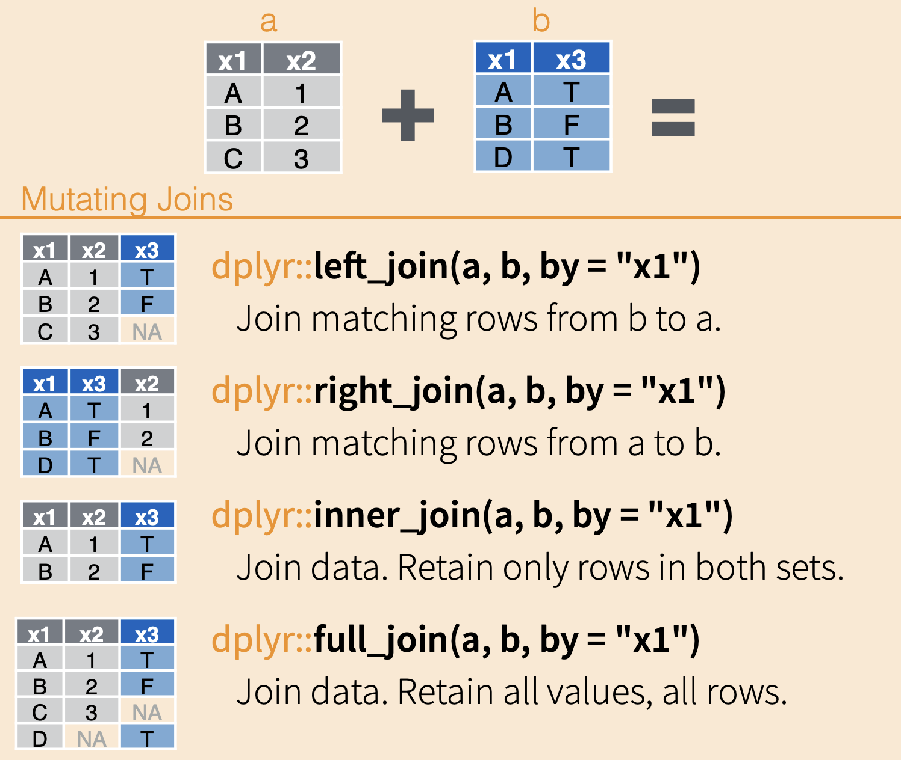
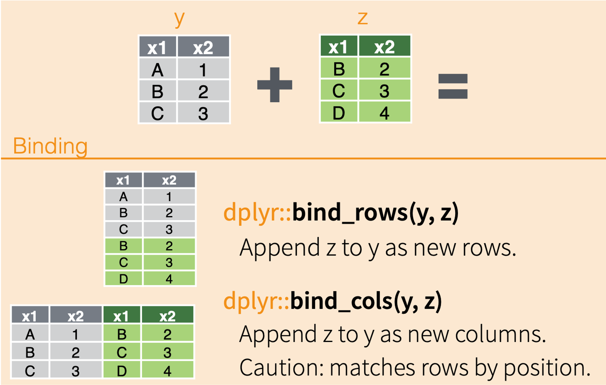

```{r setup, include=FALSE}
knitr::opts_chunk$set(echo = TRUE)
```

## The Context

After the series of incidents where a number of the collars made by Budget Collars LLC seem to be failing, our team decided to try and replace as many of them as possible. Besides, their battery life is far inferior.

We're placing as many collars on as many seals as we can, and we are starting to run short on collars.

One of our intrepid data science team members found an old box of collars and some data on all of the collars (it was a real challenge getting this data off of an old floppy drive, but she managed).

### Our Tasks

We're going to spend the next lessons tackling two tasks:

**1) First, we'll work to join data sets together.**

Our main goal is to create a single data set that includes the data we have previously looked at for collars, the data on the new collars, as well as the additional data on the old collars.

This is a little tricky, as the collar IDs need to be matched up with their counterparts across datasets, and new collars need be added. Unfortunately, the new collars have IDs and some additional data, but we don't know the maker of the new collars.

**2) Second, we will try to identify the maker of mystery collars.**

In order to do this, we will skim the surface of machine learning. We can use a common classification algorithm, K-Nearnest Neighbors (KNN), to predict which maker made which of our unidentified collars. Don't worry, we won't go into *too* much detail here, but I want to you to at least have a general idea of how it works.

## Combining Data (Joins and Binds)

Often times, we have a lot of data for one project that are related but storing all of the data in one file would add unnecessary redundancy (e.g., data in certain rows would need to be repeated too often). Other times, data has been collected separately and needs to be combined before analysis.

Being able to join together data from related tables is a key skill in data science, and for working with larger data structures (databases with their own languages, like SQL).

### The Data

Let's load in the `tidyverse` and the data we're working.

```{r message=FALSE}

```

First, let's explore our data. We want to focus on 2 things here:

(1) the columns: which ones match columns in other datasets
(2) collar identity: which datasets have matching collars or new collars

```{r}

```

### Diagramming

In small groups, talk through the process of combining these three datasets. Think about the following:

-   which columns match and which ones don't?
-   which rows match and which ones don't?
-   does the order in which we combine datasets matter?

Draw out a diagram that represents how this process might go.

## Joins vs. Binds

Now that we've decided on a process for how to combine our data, let's figure out which functions we are going to use to accomplish this task.

We have 2 main methods of combining datasets, and they work in different ways.

### Joins

Joins are arguably the more complicated of the two types of ways to combine data, but they are, therefore, the more flexible and useful.

The magic of comes comes because they match up columns of data based on unique identifiers in each row of data.

In the following diagram, the two example data frames have the column `x1` in common, and each of the values in `x1` are unique (no repeats in the same data frame). When combining the datasets, all of the columns are added, and their rows are matched up to their respective values in the `x1` column.

This can happen a couple ways, depending on which data frame is the reference and how much data you want to retain.

{width=50%}

### Binds

The other way we can combine data sets in through binds. Binds act similarly to gluing datasets together.

They don't match up data based on unique identifiers; instead they match up data by column name (`bind_rows`) or row position (`bind_cols`)

{width=50%}

How should we go about combining our three datasets? Come up with a plan that you think will work.

## Task 1: Combine Our Data

### Step 1

Our first step in to merge the old collar data with the new data about those old collars.

```{r}


```

If we take a look our new data frame, we should hopefully see that the values for `antenna_length` and `weight` have been matched up with their respective collar id.

Could we have used another tactic to combine these two datasets? What would the pros and cons be?

### Step 2

Now we need to add the new collars to our dataset. What is our best method for combining?

```{r}

```

Let's take a look at our new data frame! Have we correctly accomplished our first task?

### Saving our New Data

Now that we've accomplished our first task, we are going to want to use this combined dataset to accomplish our next task, which is using a classification algorithm to help us predict which maker made the mystery collars.

To save our data as a .csv file that we can use in another analysis, we are going to use a function that exports the dataset (`write_csv`) instead of importing it (`read_csv`).

The `write_csv` function requires the name of the dataframe to export as the first argument and the name of the file we want to create as the second argument.

```{r}

```

If we look over in our Files tab, you should see your new .csv file!
