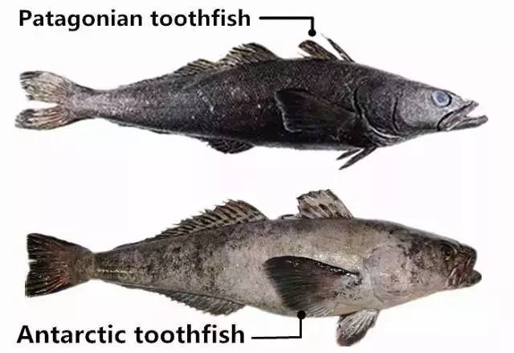
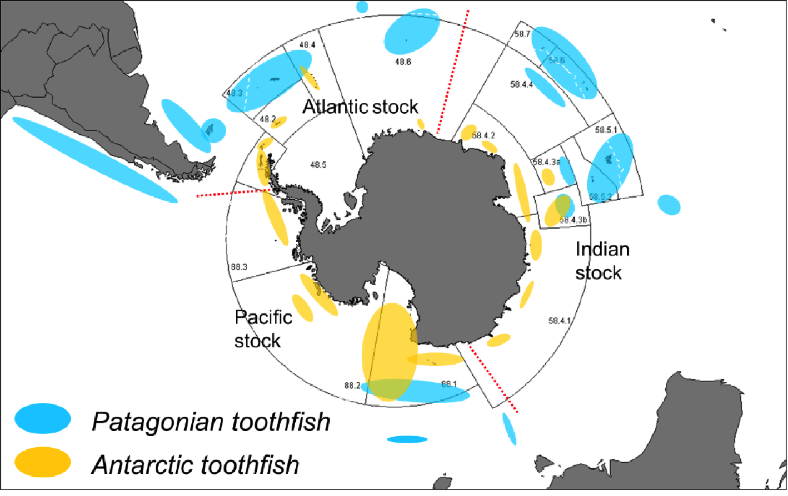

```{r setup, include=FALSE}
knitr::opts_chunk$set(echo = TRUE)
```

# Assignment Details

### Purpose

The goal of this assignment is to assess your ability to apply concepts of data visualization, measures of central tendency and variability, fitting logistic growth models, and using inferential statistics to compare populations.

### Task

Write R code which produces the correct answers and correctly interpret the results of visualizations and models.

### Criteria for Success

-   Code is within the provided code chunks
-   Code chunks run without errors
-   Code produces the correct result
    -   Code that produces the correct answer will receive full credit
    -   Code attempts with logical direction will receive partial credit
-   Written answers address the questions in sufficient detail

### Due Date

December 9 at 10:45 am MST

------------------------------------------------------------------------

# Assignment Questions

Some of our colleagues from the "mainland" have heard about our work estimating carrying capacities and fitting logistic growth models to populations and have asked for our help.

In their research, they have been using the mass (weight) of the fish they have caught to estimate populations of fish over the last 50 years. In fisheries, using mass as a proxy for--or representation of--abundance is common practice.

Our colleagues have collected data in an interesting location, where the ranges of both species of toothfish (genus: *Dissostichus*) overlap. Therefore, they have population estimates for both the Patagonian toothfish (AKA Chilean sea bass, *D. eleginoides*) and the Antarctic toothfish (*D. mawsoni*) populations in the area.

{width="49%"} {width="49%"}

They want to know (a) what the estimated carrying capacity of each population is and (b) if the population sizes are statistically different from each other.

### Set-Up

1.  Load both of the packages (`tidyverse`, `drc`) that we will need to use to answer the questions.

```{r}
library(tidyverse)
library(drc)
```

2.  Read in the dataset sent to us by our colleagues with their data.

```{r}
toothfish <- read_csv("../data/toothfish.csv")
```

3.  Examine the data frame, either through code or visually. To complete our analyses, we will need data for (a) time, (b) abundance, and (c) population. Below, identify which columns in the data frames represent which data.

-   Time: date
-   Abundance: fish_kg
-   Population: species

### Visual Comparison

Let's start with a visual comparison of the populations.

4.  Make a scatter plot of the two populations. Ensure that the dependent variable is on the y-axis and the independent variable is on the x-axis. Use color to differentiate between the fish populations.

    Be sure to modify your axes labels to be clearer and more descriptive; also, choose a theme for your plot.

```{r}
ggplot(toothfish, aes(x = date, y = fish_kg, color = species)) +
  geom_point() + 
  labs(x = "Year", y = "Fish Mass (kg)", color = "Toothfish Species") +
  theme_classic()
```

5.  Based on your plot above, make some initial observations. Does each population appear to be showing growth more akin to exponential or logistic growth? Do the populations show a lot or a little variation? Does one population show more variation? Which population do you expect to have a higher carrying capacity, if it has one? (2 points)

*Answer*: logistic, lot of variation, Antarctic shows more, hard to tell but carrying capacity might be higher in Antarctic

### Fitting Models

6.  In order to estimate the carrying capacity of each population, we will first separate the data into two dataframes, one for each species of fish.

    Below, create the two new data frames. Be sure to save them as new objects.

```{r}
pat <- toothfish %>% 
  filter(species == "Patagonian")
pat

ant <- toothfish %>% 
  filter(species == "Antarctic")
ant
```

Now that we have separate data frames, we can fit the logistic models to each species' population.

7.  Let's start with the Patagonian toothfish. Use the `drm` function to fit a logistic model to the population. Remember to use the `fct = LL.4()` argument.

```{r warning=FALSE}
pat_model <- drm(fish_kg ~ date, data = pat, fct = LL.4())
pat_model
```

8.  Do the same thing for the Antarctic toothfish.

```{r warning=FALSE}
ant_model <- drm(fish_kg ~ date, data = ant, fct = LL.4())
ant_model
```

9.  Report the respective carrying capacities in the table below.

| Toothfish Species | Estimate of K |
|:-----------------:|:-------------:|
|    Patagonian     |     391.1     |
|     Antarctic     |     430.7     |

### Plotting Logistic Models

10. To add the logistic growth curves to our plot, we need to add the "fitted" or "predicted" values from the model to each data frame. We can do this using the `predict()` function within a `mutate()` function.

    In each data frame, create a new column called `predicted_values` that contains the output from the `predict()` function. Be sure to save the resulting data frame to ensure that the new column is included.

```{r}
pat <- pat %>% mutate(predicted_values = predict(pat_model))
pat

ant <- ant %>% mutate(predicted_values = predict(ant_model))
ant
```

11. Combine the data frames for the Patagonian and Antarctic toothfish back together into one data frame using the `bind_rows()` function.

```{r}
toothfish <- bind_rows(pat, ant)
toothfish
```

12. Add the logistic growth curves for each toothfish species to the scatterplot you made earlier. You will use `geom_line()` to accomplish this task.

    Optional: make the data points partially transparent so we can see the logistic growth curves more clearly.

```{r}
ggplot(toothfish, aes(date, fish_kg, color = species)) +
  geom_point(alpha = 0.5) +
  geom_line(aes(y = predicted_values)) +
  labs(x = "Year", y = "Fish Mass (kg)", color = "Toothfish Species") +
  theme_classic()
```

### Comparing Populations

13. Based on where the logistic models "level off," let's numerically and statistically analyze the two populations starting from the year 1995.

    Create and save a new data frame as an object that contains only rows from the 1995 or later.

```{r}
toothfish <- toothfish %>% filter(date >= 1995)
toothfish
```

14. Before we run any inferential statistics, let's calculate some summary statistics.

    For each species, calculate the average fish mass and the standard deviation of the fish mass.

```{r}
toothfish %>% 
  group_by(species) %>% 
  summarise(avg_fish_kg = mean(fish_kg),
            stdev_fish_kg = sd(fish_kg))
```

15. Compare the average values to the carrying capacity estimates; they will not be exactly the same, but are they close to what we might expect?

    How about our measure of variability, the standard deviation? Do those values match with your interpretation from Question 5? Why or why not? (2 points)

*Answer*: yes, both carrying capacities and st deviations match up; higher variability in Antarctic species

16. Our colleagues have asked us to use an inferential statistical test to determine whether or not the Patagonian toothfish and Antarctic toothfish populations in their study area are of significantly different sizes.

    Run the appropriate statistical test to answer their question.

```{r}
t.test(fish_kg ~ species, data = toothfish)
```

17. How do we interpret the results of this statistical test? Are the populations different sizes? How do you know? (2 points)

*Answer*: while close to 0.05, the p-value is above 0.05, meaning we cannot say with certainty that the populations are of statistically significantly different sizes
