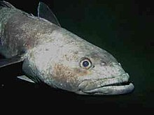
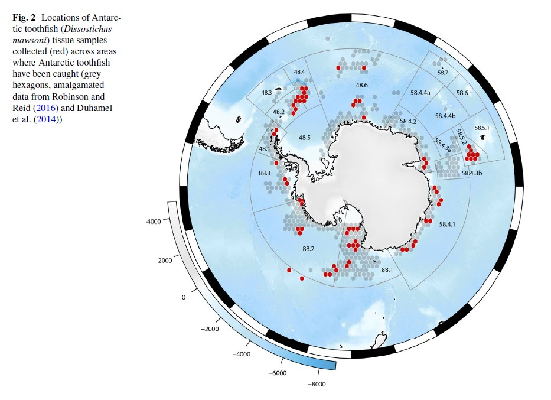
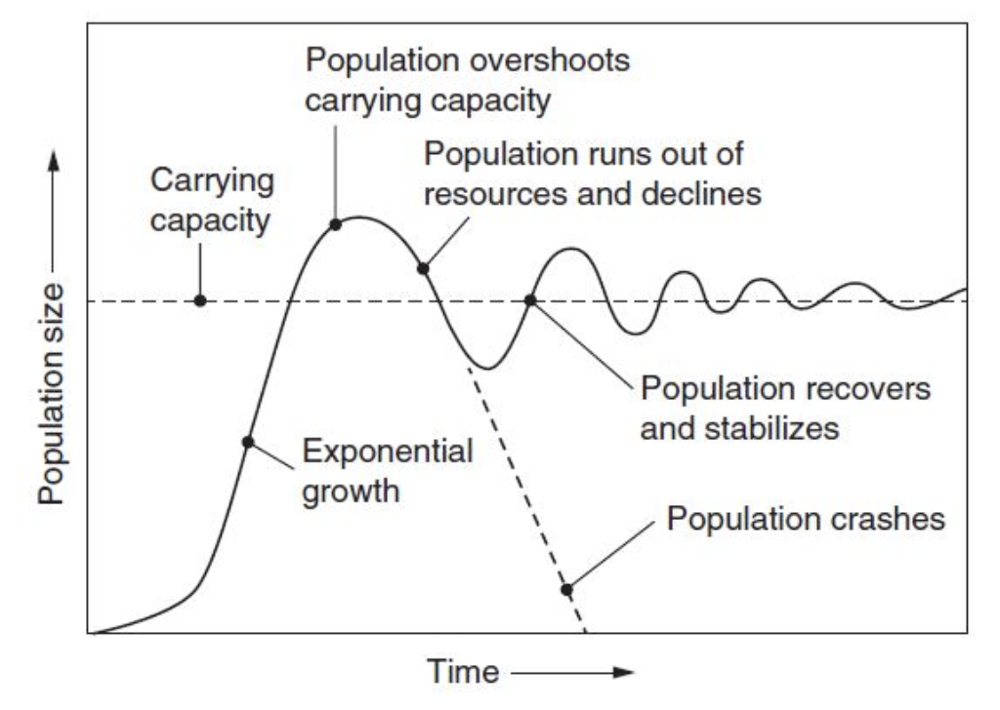
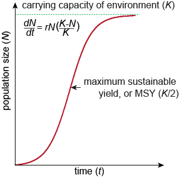

```{r setup, include=FALSE}
knitr::opts_chunk$set(echo = TRUE)
```

# Sustainable Fishing

## Applying Principles of Population Growth

We have decided that the Antarctic toothfish (*Dissostichus mawsoni*) may be a good candidate for our fishing.

{fig-align="center"}

The Antarctic toothfish is fairly widely distributed around Antarctica. The hexagons below show where the Antarctic toothfish occurs. Gray represents known distribution and red represents locations where genetic samples were taken for a study on their population (Maschette et al. 2023).

{width="75%" fig-align="center"}

However, given concerns about maintaining the fishery (an important ecosystem service), we want to make sure we do not overfish the species but rather fish sustainably.

Let's keep exploring our fish populations to help us understand what we should be focusing on when making decisions about how many fish we can sustainably harvest from any given population.

## Set-Up

As usual, we start with loading our packages and our data.

```{r}

```

Let's take a look at the data and remind ourselves what the data look like.

```{r}

```

## Population Growth Models

Let's remind ourselves about exponential growth and logistic growth.

**Expotential growth** takes births and deaths (in the form of the intrinsic growth rate, `r`) into account:

{width="83" fig-align="center"}

**Logistic growth** includes the intrinsic growth rate and another important factor—resources. The resources determine the maximum number of individuals a population can have, which we call the carrying capacity (`K`):

{width="130" fig-align="center"}

This is what each type of population growth model looks like:

{width="75%" fig-align="center"}

### Which Population to Fish?

We've previously discussed what factors we want to focus on when we are deciding which population to fish. Ideally, we want to target both a large population and a stable population.

At first glance, a population that is growing exponentially seems ideal—and it is, in some ways.

But in reality, all populations will *eventually* hit some capacity on resources. Populations that are currently demonstrating exponential growth either haven't yet hit their carrying capacity or have dramatically overshot their carrying capacity, which can lead to a huge crash or a smaller crash with boom and bust cycles until it evens out around the carrying capacity.

{width="75%" fig-align="center"}

So, in order for us to feel confident that our population will be large for a long time, we probably want to choose the safer option, which is choosing a population that is showing logistic growth.

Let's select the logistic growth population with the largest value, Population D, for our next analyses.

```{r}

```

## Estimating Carrying Capacity

In our journey to determine how many fish we can sustainably harvest (i.e., remove from the population without causing the population to go extinct), we first need to determine the carrying capacity.

While the dataset contains carrying capacity estimates, those are only visual estimates. We are going to use code (and R will use a lot of math behind the scenes) to calculate a more accurate estimate from the data.

To do so, we are actually going to use a new package, `drc`.

This package will let us fit a logistic model and provide an estimate of the asymptote of the curve, or the value where the curve levels off and not longer increases. This is our estimate of `K`, the carrying capacity of the population.

```{r message=FALSE}
# load the drc package; text when you load it is fine (as long as it doesn't say error)

```

Now, we are going to use a function from the `drc` package called `drm()` to fit our logistic growth model.

It works very similarly to the inferential statistics models from Module 3 except instead of finding a straight line of best fit, this line of best fit is allowed to curve like the logistic growth model.

What kind of growth do we think we have based on this plot? Logistic

```{r}
# Fit the model to the data
# 'N ~ year' means we're predicting N (population) as a function of 'year'
# fct = LL.4() specifies to fit a logistic growth model

```

This time, unlike with the linear model, we are interested not in a p-value but in the estimate of a specific value from the model--the carrying capacity.

To get all of the estimated values, we will use a function called `coef`, which is short for "coefficient," to give us the estimates from the `model` object.

```{r}

```

In this case, we happen to be interested in the estimate they are calling `d:(Intercept)`; this is what we are calling `K`, the carrying capacity. Let's save that value.

The simplest way to choose one value from the vector `estimates` is to use square brackets for subsetting, something we haven't done since Module 1! We want the 3rd value.

```{r}

```

Our estimate for the carrying capacity is 104.5 fish, which is close to the carrying capacity value in the dataset (100).

We can remove the label (`d:(Intercept)`) if we want to by using the `unname()` function. Now our object `K` is only the number for the estimate of the carrying capacity.

```{r}

```

### Plotting the Carrying Capacity

Let's now add this estimated carrying capacity value to our plot of the data.

First, let's plot the population data alone.

```{r}

```

To add the a line representing the carrying capacity, we can use `geom_hline()` to add a horizontal line where the y-intercept is equal to the carrying capacity.

This is very similar to how we used `geom_vline()` to add a vertical line to histograms to represent the mean value.

```{r}

```

## Maximum Sustainable Yield

Once we have an estimate of the carrying capacity for a population, we can calculate something called the *maximum sustainable yield*, or MSY.

The MSY is the number of individuals that we can remove from the population and keep the population stable (or increasing). If we remove too many individuals (above MSY), the population will not be able to reproduce fast enough to replace the harvested individuals, causing a decline in the population—in this case, from over-fishing.

{width="49%"} {width="49%"}

While the concept behind how we get to the equation for MSY may be a bit complex, thankfully, the equation itself is quite straightforward:

{fig-align="center"}

Let's calculate the maximum sustainable yield for Population D.

```{r}

```

This means that we can take about 52 fish from this population annually and keep the population stable!

If we take fewer than 52 fish, the population will increase (until the carrying capacity, that is). If we take more than 52 fish, however, we are over-fishing the population, meaning the population will not be able to reproduce enough to maintain the population and will eventually collapse.
