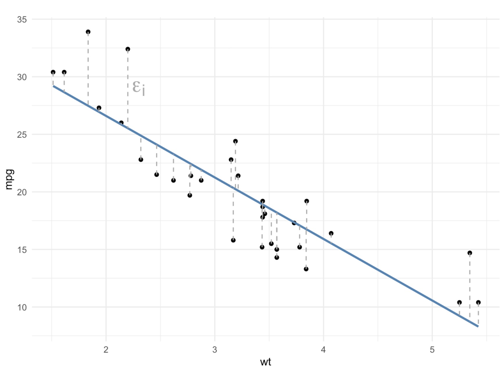

```{r setup, include=FALSE}
knitr::opts_chunk$set(echo = TRUE, message = FALSE, warning = FALSE)
```

# Comparing Populations

Throughout this module, we have learned how populations demonstrating exponential growth and logistic growth differ from one another, both conceptually and visually.

While we have fit models to some of these populations (specifically, logistic growth models), we have done so in order to estimate the carrying capacity of the population rather than to use inferential statistics to determine if the populations are statistically significantly different from one another.

In today's lesson, we are going to learn how to (a) add those logistic growth models to our data visualizations and (b) compare populations statistically.

## Set Up

As always, we need to start by loading the packages we are going to use along with our data.

First, let's load our packages. We are going to be using both the `tidyverse` and `drc` packages in this lesson, so we need to load both of them.

```{r}
library(tidyverse)
library(drc)
```

Next, we want to bring in our dataset.

```{r}
pops <- read_csv("../data/comparing_populations.csv")
```

We can use the `head()` function to take a look at the data. What data do we have?

```{r}
head(pops)
```

After inspecting our dataset, it looks as though we have more time-series data of population abundances. It isn't immediately clear how many populations there are, but perhaps the populations are named after their locations ("NE" could stand for "Northeast").

## Visually

Let's first start our investigation of these populations by plotting the data points as a scatterplot.

As we have done throughout this module, we will want the variable representing time to be on the x-axis and the population abundance (N) on the y-axis.

We will also want the data points to be distinguished by which population they are from, so we need to specify the `color` argument within the `aes()` function.

```{r}
ggplot(pops, aes(year, abund, color = population)) +
  geom_point() + 
  labs(x = "Year",
       y = "Abundance",
       color = "Fish Population") +
  theme_bw()
```

### Interpretation

Based on the plot, what do you notice about these populations?

-   Are they more likely exhibiting exponential or logistic growth? Why?
-   How do the populations appear to differ from one another?

Given your answers to the questions above, what might be a good next step?

## Numerically

When comparing different categories or groups (in this case, comparing different populations), we typically compare them both visually and numerically before conducting statistical tests.

Since we have already made visual comparisons, let's compare the populations numerically.

Typically, we have compared groups with measures of central tendency and measures of variability. Do you think that is what we should do here? Why or why not?

### Separate Populations

Unlike our typical procedure, in order to fit logistic models to each population, our simplest way forward will be to create one data frame for each population.

| NOTE: in case you are wondering, yes, there are definitely ways to fit a logistic model to each population without separating them! However, we would have to introduce quite a few new concepts to do so efficiently, so we are going to stick with the tried-and-true process of running the models individually.

We can use the `filter` function to select each population, one at a time.

```{r}
pop_NE <- pops |> 
  filter(population == "NE")

pop_SE <- pops |> 
  filter(population == "SE")

pop_SW <- pops |> 
  filter(population == "SW")
```

### Finding the Carrying Capacity

Now that we have data frames for each of the populations, we can fit the logistic model to each population and determine the estimate of the carrying capacity for each.

As we run the code to fit the model to each population, we might receive some warnings: "Warning :NaNs produced". Don't worry--that's ok! Keep going!

```{r}
# NE population
model_NE <- drm(abund ~ year, data = pop_NE, fct = LL.4())
model_NE

# if you want to be fancy and save the carrying capacity as an object
# this code combines several steps from the last lesson into one step
K_NE <- unname(coef(model_NE)[3])
K_NE
```

Now we can do the same for the SE and SW populations, too.

```{r}
# SE population
model_SE <- drm(abund ~ year, data = pop_SE, fct = LL.4())
model_SE

K_SE <- unname(coef(model_SE)[3])
K_SE

# SW population
model_SW <- drm(abund ~ year, data = pop_SW, fct = LL.4())
model_SW

K_SW <- unname(coef(model_SW)[3])
K_SW
```

Let's record the carrying capacity estimates for each population here so we can refer back to them later, if needed.

| Population | Carrying Capacity  |
|:----------:|:------------------:|
|     NE     | `r round(K_NE, 1)` |
|     SE     | `r round(K_SE, 1)` |
|     SW     | `r round(K_SW, 1)` |

As we saw in the plot, the estimated carrying capacity for the SW population is below that of the NE population.

What was much more challenging to see clearly in the plot, however, is that the estimated carrying capacity of the SE population is in between the other two carrying capacities, albeit closer to the NE population.

### Plotting the Logistic Model Curves

We can add the logistic growth models that we fit to each population into our ggplot to more easily compare the curves.

To do so requires a few steps.

1.  Use the `predict()` function to get the values for the "logistic line of best fit." Remember, these will not match up perfectly with our *actual, observed* values; these are the y-axis or `abundance` values for the best fitting logistic model at each observed x-axis value, or year.

2.  Use the `mutate()` function to create a new column in each data frame with these logistic *model* values.

3.  Combine all three dataframes back together into one dataframe using the `bind_rows()` function.

4.  Plot the actual data points using `geom_point()` and plot the logistic model data points using the `geom_line()` function.

#### Add the Logistic Model Points to the Dataframes

First, let's see what output the `predict()` function gives us for the NE population.

```{r}
predict(model_NE)
```

If we compare these numbers to the numbers in the `abund` column of `pop_NE`, we notice that they are not the same. The difference between these values from the model of best fit and the actual, observed values are called *residuals*, just as they are with lines of best fit (from linear regressions).

{width="50%" fig-align="center"}

Let's use the `mutate` function to add these model values to each dataframe.

```{r}
pop_NE <- pop_NE |> 
  mutate(logistic_model = predict(model_NE))
pop_NE

pop_SE <- pop_SE |> 
  mutate(logistic_model = predict(model_SE))

pop_SW <- pop_SW |> 
  mutate(logistic_model = predict(model_SW))
```

#### Combine Dataframes

We can now bring all three individual data frames back together into one data frame using a function called `bind_rows()`. You can think of `bind_rows` as gluing the data frames together, one after another.

The arguments in the `bind_rows()` function are all of the data frames we want glued together.

```{r}
pops_models <- bind_rows(pop_NE, pop_SE, pop_SW)
pops_models
```

The resulting data frame again has 78 observations, as did the original `pops` data frame.

#### Add Logistic Models to the Plot

We can now add the logisitic models to our plot using the `geom_line()` function. Specifically, the values from the `logistic_model` column will be the y-axis values for the lines we are adding; the x-axis values are the same as the overall plot: `year`.

```{r}
ggplot(pops_models, aes(x = year, y = abund, color = population)) +
  geom_point() +
  geom_line(aes(y = logistic_model)) +
  labs(x = "Year", y = "Abundance", color = "Fish Population") +
  theme_bw()
```

It is now much easier to visually distinguish the differences between the growth curves and the carrying capacities between the three populations!

## Statistically

We still want to analyze our three populations using inferential statistics to determine if there are significant differences between the populations.

First, we need to decide what type of statistical test makes sense with the data we have. This is *not* a straight-forward question with a straight-forward answer. How we determine which test to use ultimately depends on the question we are asking and, therefore, the hypothesis we are testing.

For the sake of the class (and in your assignment, too), let's assume the question we want to ask is whether the average population sizes significantly differ between the populations.

What type of statistical test should we use to answer that question?

What would the null and alternative hypotheses be for that statistical test?

### Filtering the Data

To most accurately compare the populations, we likely want to restrict the comparison to when the populations (or the models of best fit, at least) are fairly leveled off.

(Again, this is more of an estimation than an exact science, though there are more precise--and complicated--tools that could be used.)

A rough estimation would be that the models mostly level off around year 15; let's filter our data to include only abundance from year 15 and later.

```{r}
pops_15_25 <- pops_models |> 
  filter(year >= 15)
pops_15_25
```

### Running the Statistical Analysis

Now that we have filter our data, we can conduct our statistical test.

```{r}
model_aov <- aov(abund ~ population, data = pops_15_25)
summary(model_aov)
```

This p-value tells us that the overall model is significant (we reject the null hypothesis), but it doesn't tell us which populations are significantly different from one another. To determine which populations differ from each other, we need to run *post hoc* pairwise-comparisons.

```{r}
TukeyHSD(model_aov)
```

How do we interpret these results? What are our conclusions?

## Data-Driven Decision Making

Our ultimate goal in this module has been to determine which population of fish is best for fishing sustainably. We are prioritizing large, stable populations.

Given those requirements and what our numeric, visual, and statistical tests have told us, which of these populations would be the best for us to harvest? Why?
